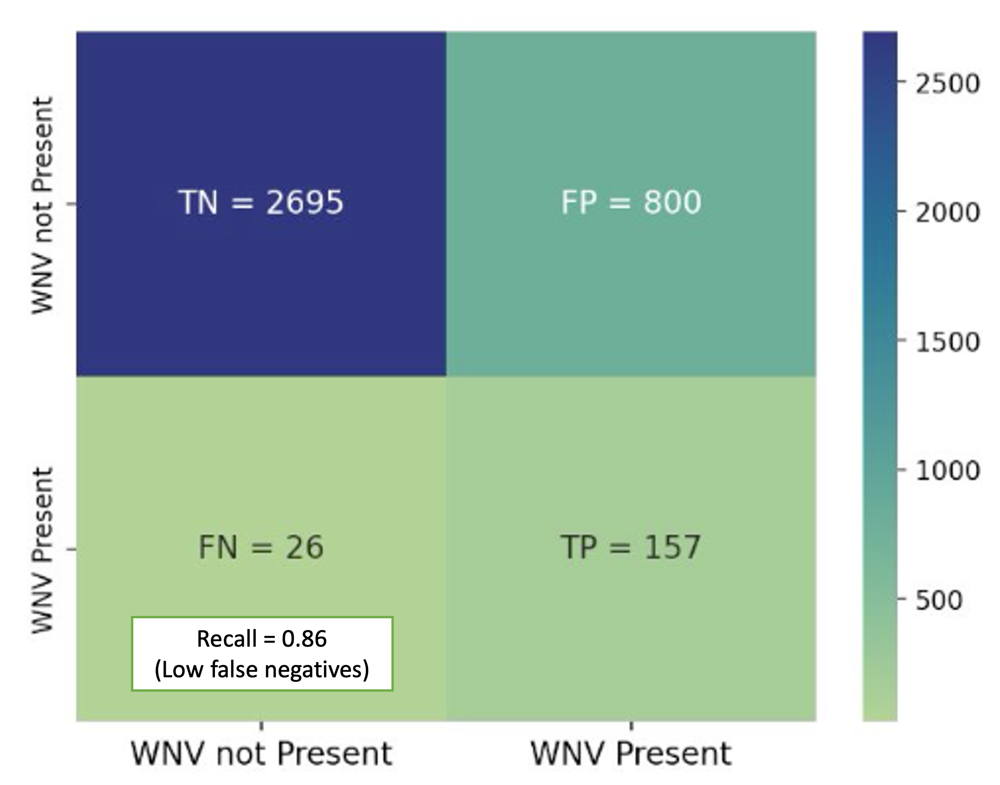

# Hi!
**Welcome to my growing collection of projects related to data science, machine learning and NLP.**

___ 
###  Ingredient detection and recipe recommender 
The key aim of this project was for households to utilise existing ingredients and whip up a meal, with a vision of expanding into smart home appliances and/or end-to-end user shopping experience. In 2 weeks, I custom trained a convolutional neural network model (Yolov8m) to detect ingredients from images and suggest Singaporean recipes. I achieved 75% mean average precision across 30 ingredient classes that are common to local recipes. The demo was eventually deployed via FLASK at Pythonanywhere. 
<figure>
    
    
<figcaption>Fig (left). example of predicted ingredients</figcaption>
<figcaption>Fig (right). mean average precision(IoU 0.5) of 0.75 across 30 classes</figcaption>
</figure>

[View code at <a href="https://github.com/githubberst/capstone-sg-recipe-recommender">Github</a>]   [Demo app at <a href ="https://githubberst.pythonanywhere.com">Pythonanywhere</a>]

Tools used: `Python`, `Jupyter`, `NLP`, `Roboflow`, `Google Colab`, `FLASK` 

Category: Computer vision, Deep Learning 

Year: Aug 2023 (ongoing)

___
###  Predicting virus in mosquitoes 

The key aim of this project was to predict virus presence in mosquitoes for the city's ops and resource planning in containing the vector-borne virus. I built a gradient boosted decision tree model, achieving 88% ROC AUC. It was found that weather factors related to "month", "temperature", "time of sunset" were strong predictors of virus presence. 

<figure>
    
    
<figcaption>Fig (left). example of predicted risk in a map</figcaption>
<figcaption>Fig (right). confusion matrix depicting high recall</figcaption>
</figure>

[View code at <a href="https://github.com/githubberst/project-virus-predictor">Github</a>]   [Demo app at <a href ="https://virus-predictor-mozzie.streamlit.app/
">Streamlit</a>]

Tools used: `Python`, `Jupyter`

Category: Predictive modelling, Decision trees, Classification, Kaggle Challenge 

Year: July 2023 

___
###  Classifying specialty diet preference using NLP 

The key aim of this project was to classify and predict a user's specialty diet preference based on text inputs. Subreddits for Keto and Paleo diets were scraped, insights extracted, and features extracted for creation of the eventual logistic regression model (93% F1 score). It was found that words like "fat" and "cream" tended to predict Keto over Paleo. 

<figure>
    
    
<figcaption>Fig (top). Exploratory analysis of both subreddits</figcaption>
<figcaption>Fig (bottom). SHAP feature importance plot</figcaption>
</figure>

[View code at <a href="https://github.com/githubberst/project-NLP-keto-paleo-diets">Github</a>]   [Demo app at <a href ="https://are-you-keto-paleo.streamlit.app/">Streamlit</a>]

Tools used: `Python`, `Jupyter`, `NLP`

Category: Predictive modelling, Logistic Regression, Classification 

Year: June 2023 

___

###  Predicting HDB resale prices

The key aim of this project was to predict Singapore's HDB resale prices based on historical datasets. A ridge regression model was developed with a 90% accuracy score based on 34 features. A bigger floor area, higher floor and hawker centres nearby were found to be strong positive predictors. Contrary to popular belief, distance to a good primary school was not found to be a strong predictor. 

<figure>
    
    
<figcaption>Fig (top). feature importance plot</figcaption>
<figcaption>Fig (bottom). plot of predicted versus actual values</figcaption>
</figure>

[View code at <a href="https://github.com/githubberst/project_HDB_resale_price_predictor">Github</a>]   [Demo app at <a href ="https://hdbresalepricepredictor.streamlit.app/
">Streamlit</a>]

Tools used: `Python`, `Jupyter`

Category: Predictive modelling, Linear Regression, Kaggle Challenge

Year: May 2023 

___